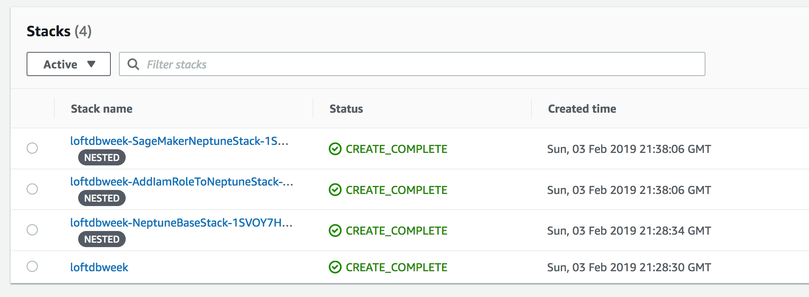
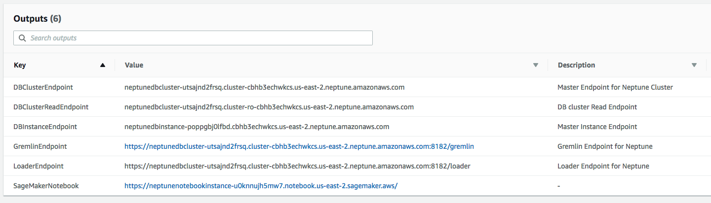

# Build Your First Graph Application with Amazon Neptune

## Overview

The following lab will walk you through an introduction to using the Gremlin graph traversal language, part of the Apache Tinkerpop graph framework.  Amazon Neptune supports the Tinkerpop framework and Gremlin traversal language to allow users to create property graphs and graph-based applications.  In the lab, you will use a sample of the open IMDB.com movie database stored in a graph data model within Neptune to answer specific questions.  This lab starts off with two Jupyter Notebooks to teach you the basics of Gremiln.  It ends with a Jupyter Notebook containing a set of challenges where you have to write Gremlin traversals on your own.

## Prerequisites

We will be using Amazon SageMaker and AWS CloudFormation to set up infrastructure required for this tutorial. Additionally as part of the setup we will be using IAM to make sure Neptune has appropriate permissions.  

## Setup Instructions

*   Log into the [AWS console](https://console.aws.amazon.com/) if you are not already.
*   Use the corresponding CloudFormation template depending on which Loft location you are attending:

| Loft Location | Template |
| ------ | -------- |
| New York Loft |  |
| San Francisco Loft |  |

*   The **Launch Stack** links above will take you to the CloudFormation console with the appropriate CloudFormation template already populated.  At the Create Stack screen, go ahead and click the Next button.
*   At **Specify Stack details** screen leave default settings and click Next.
*   At **Configure stack options** screen leave default settings and click Next.
*   At **Review** screen, scroll to the bottom.  In the blue highlighted **Capabilities** section, be sure to check the boxes next to both acknowledgements.  This is acknowledging that this template will be creating its own IAM roles.  After checking both boxes, click the **Create Stack** button.
*   After launching the stack, go back to the CloudFormation console homepage (click the CloudFormation link at the top of the page.)
*   The CloudFormation template will launch three nested stacks.  Click the refresh button in the CloudFormation console (top-right of the screen) as the CloudFormation stacks are running.  Once all of the stacks are loaded successfully, you should see a screen that looks like this:

## After stack creation

*   Once the stack is created, click on the root stack in the CloudFormation console (the bottom stack in the above image called 'loftdbweek').  This will take you to the Stack Details screen.
*   Click on the Outputs tab in the Stack Details screen.  You should see a list of outputs similar to this:

*   The last output listed is for a SageMaker Notebook Instance.  This contains a set of Jupyter Notebooks that we will use for the remainder of this lab.  Click on the link for the SageMakerNotebook output.  This will open the Jupyter Notebook console. 
*   Within the Jupyter Notebook console, navigate the directory tree to the Neptune/notebooks folder.  You will see the four Jupyter Notebooks.  Start with the 01-Setup notebook and follow the instructions carefully. 

**Note**: Make sure to delete the CloudFormation stack after the workshop to delete all associated resources. Go to AWS Console > CloudFormation in the same region that you created the stack in and delete the stack.

## Web Application (Optional)

We have put together the following sample web application that demonstrates how to build a frontend application that consumes data from Neptune. Please refer to the README for further instructions to setup the application: [neptune-workshop-ui](https://github.com/triggan/neptune-workshop-ui)
